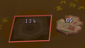
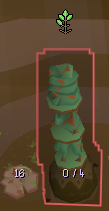
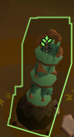
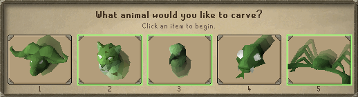
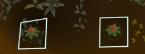
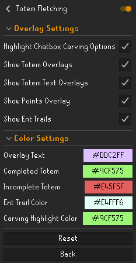

# Totem Fletching

[](https://runelite.net/plugin-hub)
[](LICENSE)
[](https://github.com/TheRealGuru/totem-fletching/issues)

A RuneLite plugin that enhances the Varlamore fletching activity in Old School RuneScape by displaying correct animal choices, progress, and other useful information for the Vale Totems fletching minigame in Auburnvale.

## Features

- **Carving Overlay**: Shows optimal carving actions
- **Progress Tracking**: Visual indicators for totem completion / number of decorations.
- **Ent Trail Tracking**: Displays ent trail locations and timers
- **Real-time Point Display**: Shows current points earned on each totem
- **Customizable Colors**: All colors are user-controlled enabling users to personalize the experience

## Screenshots

### Main Overlays






### Carving Interface


### Ent Trail Tracking


## Configuration

Access the configuration through RuneLite's settings panel:

### Configuration Options
- **Highlight Chatbox Carving Options**: Enables the carving interface overlay similar to quest helper
- **Show Totem Overlays**: Display the overlays on the totem game objects
- **Show Totem Text Overlays**: Display text overlays on the totem game objects
- **Show Points Overlay**: Display the amount of claimable points on the offerings game object
- **Show Ent Trails**: Highlight the tile of Ent Trails when they are inactive/can be stepped on.

### Configuration Panel


## Contributing

Contributions are welcome! Please feel free to submit a Pull Request or [open an issue](https://github.com/TheRealGuru/totem-fletching/issues/new) if you would like to have a feature added.

### Code Style

This project uses Google Java Format with 4-space indentation:

```bash
# Check formatting
./gradlew spotlessCheck

# Apply formatting
./gradlew spotlessApply
```

### Project Structure

```
totem-fletching/
├── src/
│   ├── main/java/
│   │   └── com/github/therealguru/totemfletching/
│   │       ├── action/          # Game action handlers
│   │       ├── model/           # Data models
│   │       ├── overlay/         # UI overlays
│   │       └── service/         # Core services
│   └── test/                    # Unit tests
├── build.gradle                 # Build configuration
└── runelite-plugin.properties   # Plugin metadata
```

### How to Contribute

1. Fork the repository
2. Create your feature branch (`git checkout -b feature`)
3. Commit your changes (`git commit -m 'Add some AmazingFeature'`)
4. Ensure code passes formatting checks (`./gradlew spotlessCheck`)
5. Push to the branch (`git push origin feature`)
6. Open a Pull Request

### Contribution Guidelines

- Follow the existing code style (Google Java Format, 4-space tabs)
- Write meaningful commit messages
- Update documentation as needed
- Ensure all tests pass before submitting

## Support

### Reporting Issues

Found a bug or have a feature request? Please [open an issue](https://github.com/TheRealGuru/totem-fletching/issues/new) with:

- Clear description of the issue/feature
- Steps to reproduce (for bugs)
- Expected vs actual behavior
- Screenshots if applicable
- RuneLite version and plugin version

## License

This project is licensed under the BSD 2-Clause License - see the [LICENSE](LICENSE) file for details.

## Acknowledgments

- Thanks to the RuneLite team for the excellent plugin framework
- The OSRS community for feedback and suggestions
- All contributors who have helped improve this plugin

---